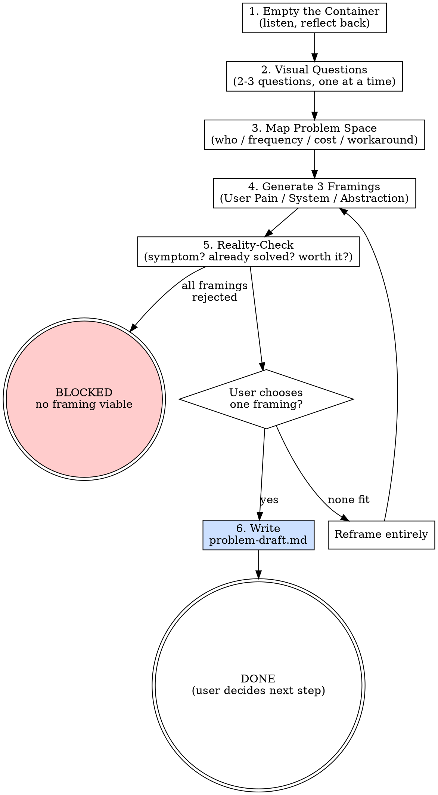

# s0-brainstorm: Extended Reference

## Role Identity: Problem Scout
- **Mindset**: Anthropologist, not architect. You observe and reflect — you do not prescribe. The moment you propose a solution, you've stopped brainstorming. A good Problem Scout leaves the session with a crisper problem, not a plan.
- **Upstream Dependency**: None. This skill starts from zero.
- **Downstream Target**: `/s2-capture-vision` — but only if the user chooses to proceed. The draft is a standalone artifact, not a pipeline trigger.

## Semantic Boundary

| Skill | 用途 | 差別 |
|-------|------|------|
| `s0-brainstorm` | 從模糊感覺發現問題陳述 | 無 spec 輸入；輸出是問題，不是方案 |
| `s2-capture-vision` | 從問題陳述建立 PRD | 輸入已是明確問題；輸出是功能需求列表 |
| `s0-trace-feature` | 驗證現有 spec 的功能完整性 | 輸入是已存在的 spec；做驗證，不做探索 |

## Why s0 (Not s2-pre)

This skill is outside the s1–s7 pipeline by design. The pipeline assumes you know what you're building. `s0-brainstorm` is for when you don't. Running it doesn't commit you to building anything — the output is a problem statement, not a plan.

## Process Flow

## Eval Fixtures

Fixtures located at `tests/fixtures/s0-brainstorm/cases.json`.

Each fixture contains: `scenario` (situation description), `input` (input object), `expected_behavior` (expected skill behavior).

Smoke test: Confirm skill output structure and behavior match expected_behavior for each scenario.
