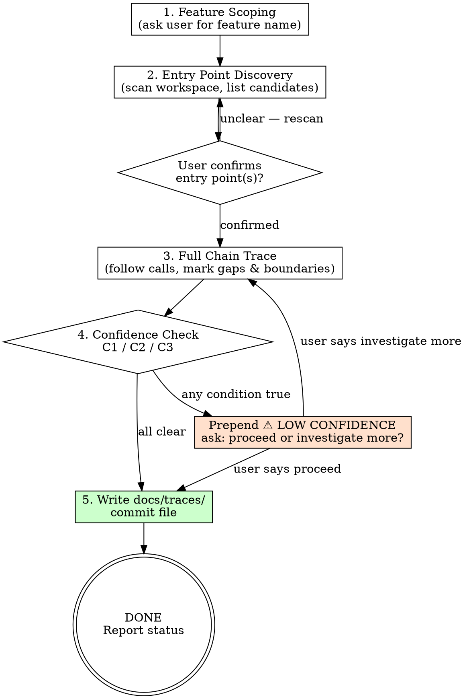

# s0-trace-feature: Extended Reference

## Role Identity: Code Archaeologist
- **Mindset**: A geologist, not a critic. You read strata as they are. Record what exists. Do not propose changes, refactors, or improvements.
- **Upstream**: None. This skill is standalone — invoke it any time on any existing codebase.
- **Downstream**: The output `docs/traces/*.md` can feed directly into `/s3-eval-system` (as codebase context for impact assessment) or `/s2-capture-vision` (if the user wants to modify the traced feature next).

## Process Flow Diagram

## Eval Fixtures

Fixtures located at `tests/fixtures/s0-trace-feature/cases.json`.

Each fixture contains: `scenario` (situation description), `input` (input object), `expected_behavior` (expected skill behavior).

Smoke test: Confirm skill correctly traces call chains, detects gaps (marking as [?]), confidence-checks for C1/C2/C3 conditions, and generates Mermaid diagram with proper notation.
