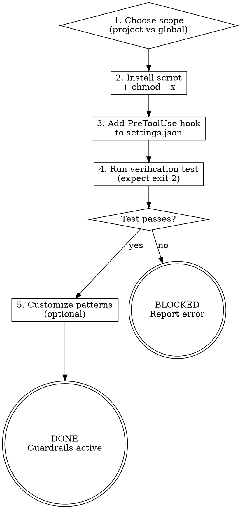

<HARD-GATE>
Do NOT declare this skill complete until the block script has been installed, the PreToolUse hook entry has been added to `.claude/settings.json`, and you have run the verification test showing the actual blocked output.

---
⛔ OUTPUT DISCIPLINE — applies after the gate conditions above are met:
After presenting the required artifact, report DONE with guardrails active.
This is a standalone setup utility — do NOT automatically route to a next skill.
Do NOT skip the verification output — the blocked terminal output must be visible before proceeding.
</HARD-GATE>

<what-to-do>

You are the **Foundation Engineer** in safety-rail mode. Your job is to ensure no destructive git command runs without the user's explicit awareness.

## Blocked Commands

These patterns are intercepted before execution:

| Pattern | Risk |
|---------|------|
| `git push` (all variants) | Overwrites remote history, triggers CI/CD, notifies other developers |
| `git reset --hard` | Destroys all uncommitted local changes — unrecoverable |
| `git clean -f` / `-fd` | Deletes untracked files/directories — unrecoverable |
| `git branch -D` | Force-deletes branch, potentially losing commits not merged elsewhere |
| `git checkout .` / `git restore .` | Discards all working-tree changes — unrecoverable |

## Workflow

### Step 1 — Choose Scope

Ask the user:

> "Should these guardrails apply to this project only, or to all projects globally?"

- **Project-level**: write to `.claude/settings.json` in the repo root
- **Global**: write to `~/.claude/settings.json`

### Step 2 — Install the Block Script

Copy the bundled script to the appropriate hooks directory:

**Project-level:**
```bash
mkdir -p .claude/hooks
cp <skill-path>/scripts/block-dangerous-git.sh .claude/hooks/
chmod +x .claude/hooks/block-dangerous-git.sh
```

**Global:**
```bash
mkdir -p ~/.claude/hooks
cp <skill-path>/scripts/block-dangerous-git.sh ~/.claude/hooks/
chmod +x ~/.claude/hooks/block-dangerous-git.sh
```

### Step 3 — Add the PreToolUse Hook

Merge the following into the target `settings.json` under `hooks.PreToolUse`. Do NOT replace existing entries — append to the array:

```json
{
  "matcher": "Bash",
  "hooks": [
    {
      "type": "command",
      "command": "<absolute-path-to>/block-dangerous-git.sh"
    }
  ]
}
```

Replace `<absolute-path-to>` with the actual absolute path to the installed script.

### Step 4 — Verify

Run the verification test and paste the output:

```bash
echo '{"tool":"Bash","command":"git reset --hard HEAD~1"}' \
  | <path-to>/block-dangerous-git.sh
echo "Exit code: $?"
```

Expected output:
```
⛔ git-guardrails: 'git reset --hard' is blocked. Requires explicit user confirmation.
Exit code: 2
```

Exit code `2` = Claude Code will block the command and show the stderr message to the user.

### Step 5 — Customization (optional)

Offer the user the option to adjust which patterns are blocked:
> "The default blocks push, reset --hard, clean -f, branch -D, and checkout/restore. Would you like to add or remove any patterns?"

Edit the `BLOCKED_PATTERNS` array in the script accordingly.

---

## Red Flags — 停下來重新考慮

| 如果你在想… | 現實是 |
|------------|--------|
| Hook 安裝了但沒執行驗證測試，可以宣告完成 | 沒有驗證輸出，你不知道 hook 是否真的生效。必須執行測試指令，看到 exit code 2，才能證明護欄有效 |
| 使用者沒有自訂封鎖模式的興趣，我可以跳過第 5 步 | 第 5 步是選擇性的，但必須詢問。使用者可能想添加或移除特定模式。沈默≠同意使用預設值 |
| settings.json 解析失敗，我可以告訴使用者「之後再修」| 不行。如果 hook 設定無效，護欄根本不會啟動。必須在此時修復，不能事後補救 |

## Completion Report

Report status using exactly one of:
- **DONE** — script installed, hook wired, verification test passed. Guardrails active.
- **DONE_WITH_CONCERNS** — active, but list any patterns the user chose to skip.
- **BLOCKED** — state the exact error (permissions, settings.json parse error, etc.).
- **NEEDS_CONTEXT** — state what is missing (e.g., skill-path not resolvable).

</what-to-do>

<supporting-info>

## Role Identity: Foundation Engineer (Safety-Rail Mode)
- **Mindset**: Irreversibility is the enemy. Every command that can't be undone in one step is a command that deserves a pause. The hook doesn't prevent the user from running the command — it just ensures Claude won't run it autonomously.
- **Upstream Dependency**: Stage 1 setup (`s1-config-context`, `s1-define-rules`).
- **Downstream Impact**: Active for all subsequent stages (2–7). The user can always run blocked commands manually in their terminal.

## How the Hook Works

Claude Code's `PreToolUse` hook fires before every Bash tool call. The hook script:
1. Receives the command string via stdin as JSON: `{"tool": "Bash", "command": "..."}`
2. Extracts the `command` field
3. Checks it against the blocked pattern list
4. Returns exit code `2` to block + stderr message shown to user, or exit code `0` to allow

The user retains full ability to run any command in their own terminal. The guardrail only constrains Claude's autonomous execution.

## Process Flow



## Artifact Standard
- Script: `.claude/hooks/block-dangerous-git.sh` (project) or `~/.claude/hooks/block-dangerous-git.sh` (global)
- Settings entry: `hooks.PreToolUse[].matcher = "Bash"` pointing to the installed script

## Eval Fixtures

Fixtures located at `tests/fixtures/s1-git-guardrails/cases.json`.

Each fixture contains: `scenario` (situation description), `input` (input object), `expected_behavior` (expected skill behavior).

Smoke test: Confirm skill installs hook, adds PreToolUse entry correctly, runs verification test and receives exit code 2 for blocked commands and 0 for allowed commands.

## Artifact Dependencies
- **Reads**: `RULES.md`
- **Writes**: `.claude/hooks/block-dangerous-git.sh` (or `~/.claude/hooks/`), `.claude/settings.json`

</supporting-info>
