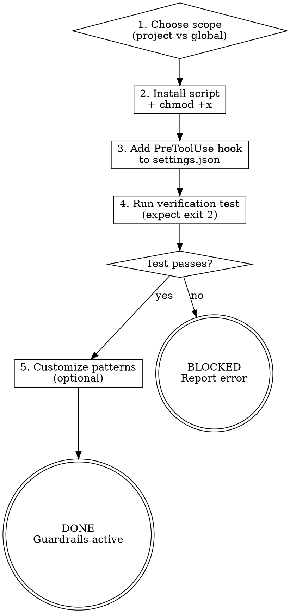

# s1-git-guardrails: Extended Reference

## Role Identity: Foundation Engineer (Safety-Rail Mode)
- **Mindset**: Irreversibility is the enemy. Every command that can't be undone in one step is a command that deserves a pause. The hook doesn't prevent the user from running the command — it just ensures Claude won't run it autonomously.
- **Upstream Dependency**: Stage 1 setup (`s1-config-context`, `s1-define-rules`).
- **Downstream Impact**: Active for all subsequent stages (2–7). The user can always run blocked commands manually in their terminal.

## Semantic Boundary

| Skill | 用途 | 差別 |
|-------|------|------|
| `s1-git-guardrails` | 安裝 PreToolUse hook 攔截破壞性 git 命令 | 只管安全 hook 安裝與驗證 |
| `s1-config-context` | 初始化 CONTEXT.md 與基礎 `settings.json` | 管理 project 元資料；不安裝安全攔截 hook |
| `update-config` | 修改 Claude Code 的任意 `settings.json` 設定 | 通用設定修改；不涉及攔截邏輯 |

## How the Hook Works

Claude Code's `PreToolUse` hook fires before every Bash tool call. The hook script:
1. Receives the command string via stdin as JSON: `{"tool": "Bash", "command": "..."}`
2. Extracts the `command` field
3. Checks it against the blocked pattern list
4. Returns exit code `2` to block + stderr message shown to user, or exit code `0` to allow

The user retains full ability to run any command in their own terminal. The guardrail only constrains Claude's autonomous execution.

## Process Flow

## Eval Fixtures

Fixtures located at `tests/fixtures/s1-git-guardrails/cases.json`.

Each fixture contains: `scenario` (situation description), `input` (input object), `expected_behavior` (expected skill behavior).

Smoke test: Confirm skill installs hook, adds PreToolUse entry correctly, runs verification test and receives exit code 2 for blocked commands and 0 for allowed commands.
