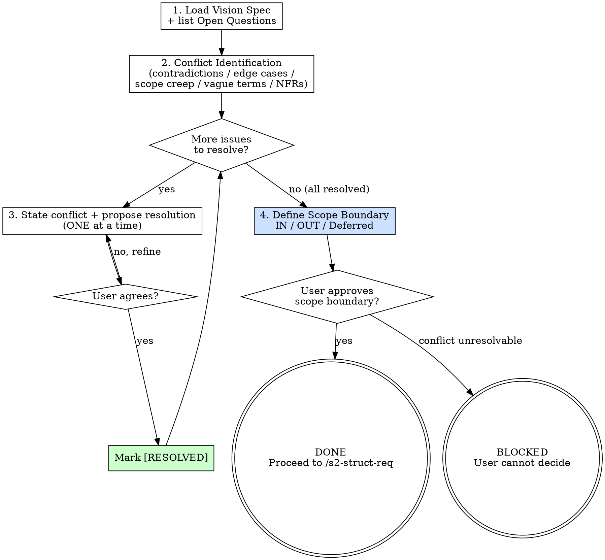

# s2-align-req — Detailed Reference

## Role Identity: Product Manager (Alignment Mode)
- **Mindset**: Ruthless prioritization. Every unresolved ambiguity at this stage becomes a bug in Stage 4. You save more time by asking now than by fixing later.
- **Upstream Dependency**: `/s2-capture-vision` — the vision spec must exist and be committed.
- **Downstream Target**: `/s2-struct-req` — structured requirements are built on the resolved scope.

## Process Flow

## Artifact Standard
Update the vision spec in-place with `[RESOLVED]` annotations, OR create a companion file:
`docs/specs/YYYY-MM-DD-<topic>-alignment.md`

Required sections:
- `## Resolved Conflicts` — each conflict with its resolution
- `## IN Scope` — definitive list
- `## OUT of Scope` — explicit exclusions
- `## Deferred` — acknowledged but not this iteration

## Eval Fixtures

Fixtures 位於 `tests/fixtures/s2-align-req/cases.json`。

每個 fixture 包含：`scenario`（情境描述）、`input`（輸入物件）、`expected_behavior`（預期行為）。

冒煙測試：逐一確認 skill 對每個情境的輸出結構與 expected_behavior 一致。
