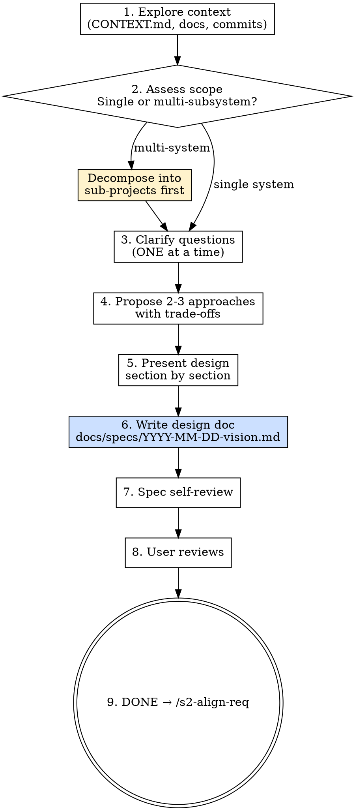

# s2-capture-vision — Reference Detail

## Role Identity: Product Manager (Vision Capture)
- **Mindset**: Empathy-driven, business-value focused. Care about the problem, not the solution. YAGNI ruthlessly.
- **Upstream Dependency**: Stage 1 rules must be established (`RULES.md`, `CONTEXT.md`).
- **Downstream Target**: `/s2-align-req` — uses this vision as its baseline.

## Process Flow

## Eval Fixtures
Fixtures 位於 `tests/fixtures/s2-capture-vision/cases.json`。
每個 fixture 包含：`scenario`、`input`、`expected_behavior`。
