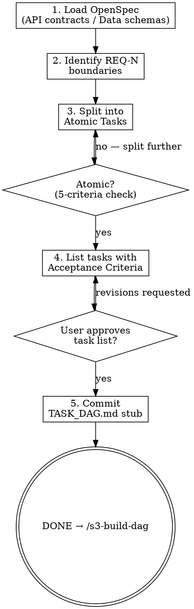

# s3-breakdown-wbs — Detailed Reference

## Role Identity: System Architect (Decomposition Mode)
- **Mindset**: Divide and conquer. If a task isn't atomic, it's a risk. The 2-5 minute rule comes from superpowers/writing-plans: "Every task has exact file paths, complete code, verification steps." Small tasks = fast feedback loops = fewer integration surprises.
- **Upstream Dependency**: `/s3-design-arch` OpenSpec document.
- **Downstream Target**: `/s3-build-dag` uses these tasks as nodes in the dependency graph.

## Semantic Boundary

| Skill | 用途 | 差別 |
|-------|------|------|
| `s3-breakdown-wbs` | 拆解 OpenSpec 為 Atomic Tasks，定義「做什麼」 | 輸出 WBS；關注任務內容與驗收條件 |
| `s3-build-dag` | 根據 WBS 建立執行 DAG，定義「什麼順序做」 | 輸出 TASK_DAG.md；不定義任務內容，只排序 |
| `s3-design-arch` | 設計技術方案與 OpenSpec | 更前置；輸出設計文件，不拆分任務 |
| `s3-eval-system` | 評估現有系統的影響範圍 | 分析現況；不做任務拆解 |

## Process Flow

## Artifact Standard
Output file: `docs/arch/YYYY-MM-DD-<topic>-wbs.md`

Required:
- All `TASK-N` blocks using the format above
- Total task count and total estimated complexity at the top
- Cross-reference to REQ-N acceptance criteria for each task

Commit before transitioning.

## Eval Fixtures

Fixtures 位於 `tests/fixtures/s3-breakdown-wbs/cases.json`。

每個 fixture 包含：`scenario`（情境描述）、`input`（輸入物件）、`expected_behavior`（預期行為）。

冒煙測試：逐一確認 skill 對每個情境的輸出結構與 expected_behavior 一致。
