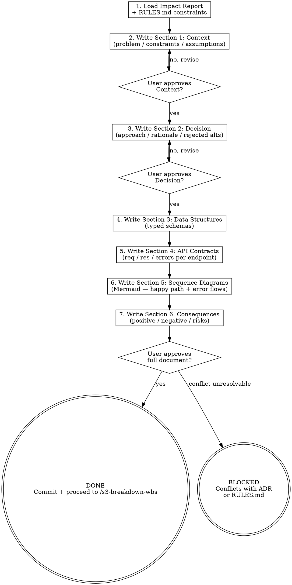

# s3-design-arch: Extended Reference

## Role Identity: System Architect (Design Mode)
- **Mindset**: Contract-first design. If it isn't written and approved, it doesn't exist. Structural elegance and interface minimalism — the best modules are deep (simple interface, rich behavior).
- **Upstream Dependency**: `/s3-eval-system` impact report; `RULES.md` architectural paradigm.
- **Downstream Target**: `/s3-breakdown-wbs` uses the API contracts and data schemas to define Atomic Tasks; Stage 4 implements against this document; Stage 5 audits against it.

## Process Flow

## Eval Fixtures

Fixtures 位於 `tests/fixtures/s3-design-arch/cases.json`。

每個 fixture 包含：`scenario`（情境描述）、`input`（輸入物件）、`expected_behavior`（預期行為）。

冒煙測試：逐一確認 skill 對每個情境的輸出結構與 expected_behavior 一致。
