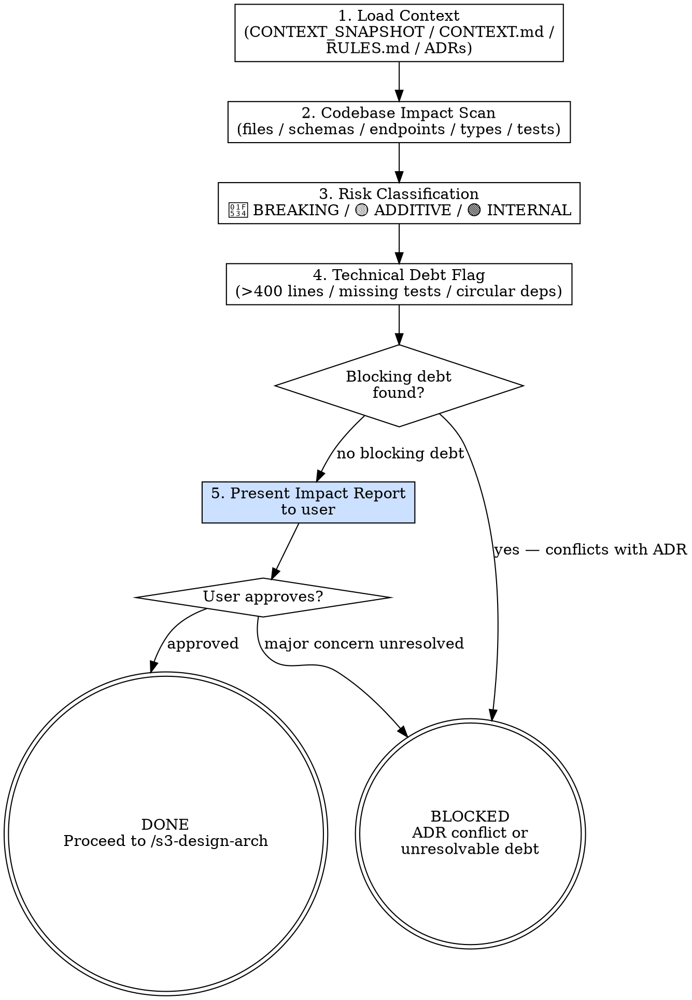

# s3-eval-system — Detailed Reference

## Role Identity: System Architect (Evaluation Mode)
- **Mindset**: Risk mitigation. You look for the blast radius of new changes. Your job is to surface surprises NOW, not after Stage 4 has written 2,000 lines of code.
- **Upstream Dependency**: `CONTEXT_SNAPSHOT.md` from Stage 2.
- **Downstream Target**: `/s3-design-arch` uses your impact report as the primary input for design decisions.

## Process Flow

## Eval Fixtures

Fixtures 位於 `tests/fixtures/s3-eval-system/cases.json`。

每個 fixture 包含：`scenario`（情境描述）、`input`（輸入物件）、`expected_behavior`（預期行為）。

冒煙測試：逐一確認 skill 對每個情境的輸出結構與 expected_behavior 一致。
