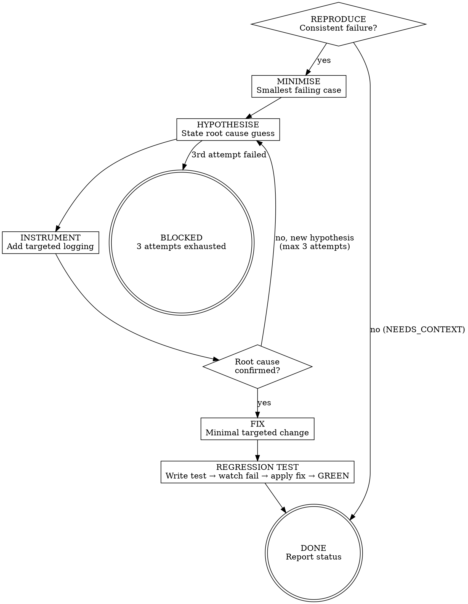

# s4-local-debug — Extended Reference

## Role Identity: Implementer (Debug Mode)
- **Mindset**: Disciplined detective. You gather evidence before forming conclusions. You never guess. If you cannot explain *why* the fix works, it is not a fix — it is a workaround.
- **Upstream Dependency**: `/s4-impl-task` (implementation complete but failing).
- **Downstream Target**: Stage 5 (Code Auditor) — only hand off code where **all tests pass** and **no debug logs remain**.

## Semantic Boundary

| Skill | 用途 | 差別 |
|-------|------|------|
| `s4-local-debug` | 診斷 tests GREEN 後仍行為異常的根因；系統化調試 | 調試已實現但行為錯誤的代碼；需先有 GREEN 狀態 |
| `s4-impl-task` | 讓失敗測試從紅轉綠 | 首次實現；測試已存在但代碼未寫 |
| `s4-tdd` | 建立失敗測試（紅燈） | 只寫測試；不動 production code |
| `s4-setup-env` | 配置開發環境與 worktree | 環境問題；若 IDE/依賴異常先用此 skill |

## Process Flow

## Artifact Standard & Eval Fixtures

- **Regression test file**: Must be committed alongside the fix
- **Commit message format**: `fix: <short root-cause description>\n\nRoot cause: <explanation>\nRegression test: <test name>`
- **No debug logs**: All `console.log` / `print` / `fmt.Printf` added during Phase 4 must be removed before handoff

Fixtures at `tests/fixtures/s4-local-debug/cases.json`. Each contains: `scenario`, `input`, `expected_behavior`.
