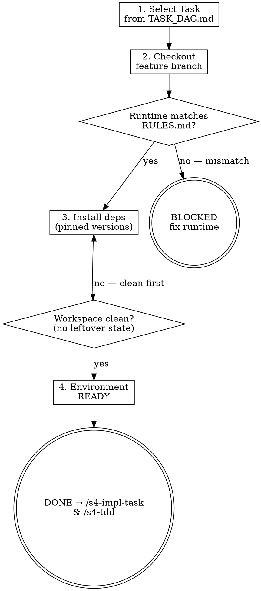

# s4-setup-env: Detailed Reference

## Role Identity: Implementer
- **Mindset**: Clean workbench. You don't start coding until the tools are sharp and the environment is pristine.
- **Upstream Dependency**: Stage 3 (Task DAG).
- **Downstream Target**: `/s4-impl-task` & `/s4-tdd`.

## Eval Fixtures

Fixtures 位於 `tests/fixtures/s4-setup-env/cases.json`。

每個 fixture 包含：`scenario`（情境描述）、`input`（輸入物件）、`expected_behavior`（預期行為）。

冒煙測試：逐一確認 skill 對每個情境的輸出結構與 expected_behavior 一致。

## Process Flow

