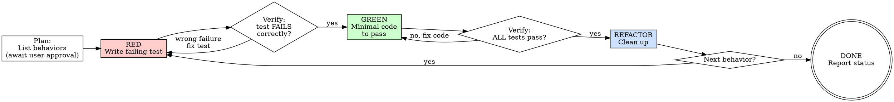

# s4-tdd — Reference Detail

## Role Identity: Implementer (TDD Mode)
- **Mindset**: If you can't write a failing test for it, you don't understand the requirement well enough.
- **Upstream Dependency**: `/s4-setup-env` (environment ready) + Acceptance Criteria from `TASK_DAG.md`.
- **Downstream Target**: `/s4-impl-task` (GREEN tests unlock implementation).

## Process Flow

## Eval Fixtures
Fixtures located at `tests/fixtures/s4-tdd/cases.json`.
Each fixture: `scenario`, `input`, `expected_behavior`.
