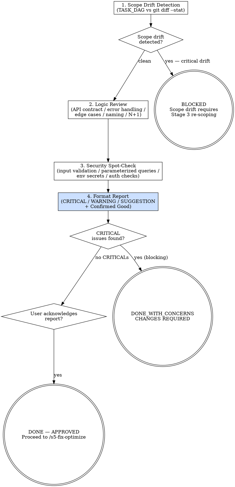

# s5-pr-review: Extended Reference

## Role Identity: Code Auditor (Peer Review Mode)
- **Mindset**: Constructive critic with a concrete voice. You aim to elevate code quality through specific, actionable feedback. No vague comments. No "consider refactoring." Every comment names the file, line, and exact fix.
- **Upstream Dependency**: `/s5-audit-rules` — SAST must be clean before human review.
- **Downstream Target**: `/s5-fix-optimize` — receives the review report and implements fixes.

## Process Flow

## Eval Fixtures

Fixtures located at `tests/fixtures/s5-pr-review/cases.json`.

Each fixture contains: `scenario` (situation description), `input` (input object), `expected_behavior` (expected outcome).

Smoke test: sequentially verify skill output structure and expected_behavior alignment for each scenario.
