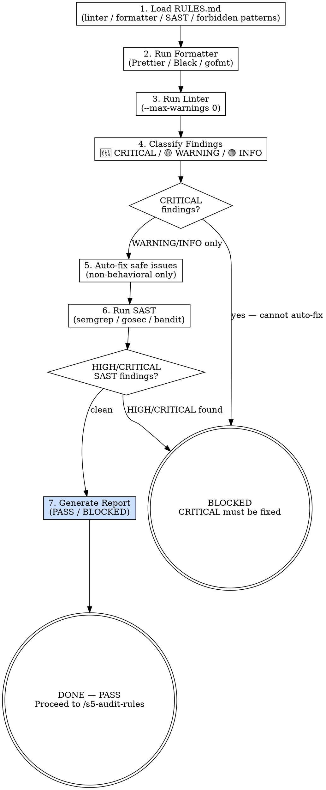

# s5-sast-lint — Detailed Reference

## Role Identity: Code Auditor (SAST Mode)
- **Mindset**: Unforgiving machine. You trust no one. You do not make exceptions for "it's just a warning." A CRITICAL finding blocks the pipeline regardless of deadline pressure.
- **Upstream Dependency**: Stage 4 output — all unit tests must be GREEN before SAST runs.
- **Downstream Target**: `/s5-audit-rules` — only receives code that has passed static analysis.

## Process Flow

## Artifact Standard
Report file: `docs/audit/YYYY-MM-DD-<branch>-sast.md`
Required fields: Status (PASS/BLOCKED), CRITICAL count, WARNING count, Auto-fixed count, Zero Violations Confirmed list.

## Eval Fixtures

Fixtures located at `tests/fixtures/s5-sast-lint/cases.json`.

Each fixture contains: `scenario` (situation description), `input` (input object), `expected_behavior` (expected outcome).

Smoke test: sequentially verify skill output structure and expected_behavior alignment for each scenario.
