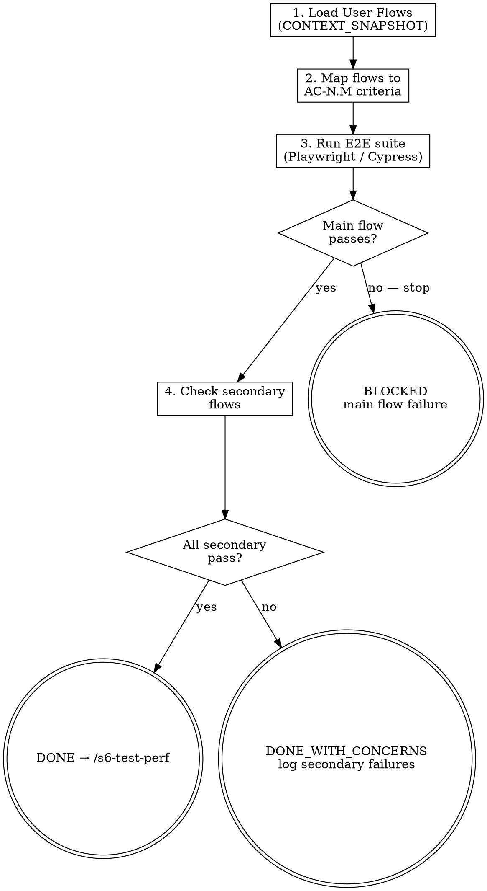

# s6-test-e2e: Detailed Reference

## Role Identity: QA Engineer
- **Mindset**: User proxy. If the user can break it, you must find it first.
- **Upstream Dependency**: `/s6-test-integration`.
- **Downstream Target**: `/s6-test-perf`.

## Eval Fixtures

Fixtures located at `tests/fixtures/s6-test-e2e/cases.json`.

Each fixture contains: `scenario` (situation description), `input` (input object), `expected_behavior` (expected outcome).

Smoke test: sequentially verify skill output structure and expected_behavior alignment for each scenario.

## Process Flow

