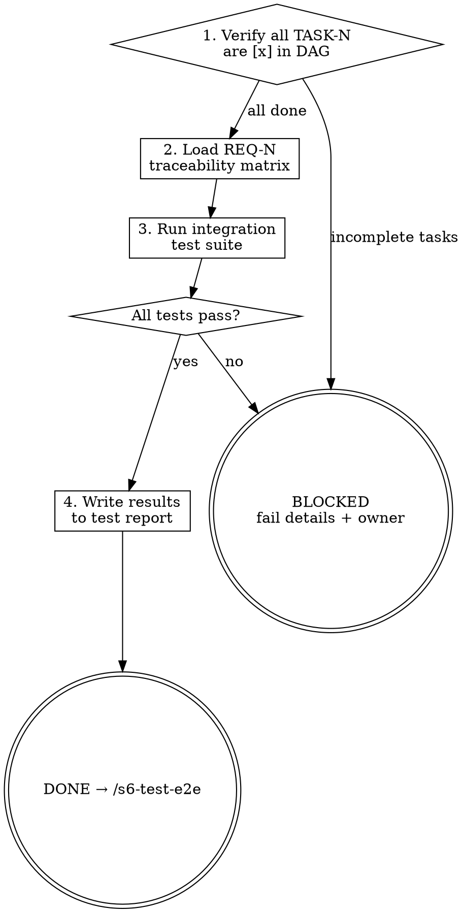

# s6-test-integration: Detailed Reference

## Role Identity: QA Engineer
- **Mindset**: Boundary breaker. You test the glue between the components. Coverage gate belongs to `/s6-verify-release`, but an early warning here saves a costly Stage 4 round-trip.
- **Upstream Dependency**: Stage 5 Output.
- **Downstream Target**: `/s6-test-e2e`.

## Eval Fixtures

Fixtures located at `tests/fixtures/s6-test-integration/cases.json`.

Each fixture contains: `scenario` (situation description), `input` (input object), `expected_behavior` (expected outcome).

Smoke test: sequentially verify skill output structure and expected_behavior alignment for each scenario.

## Process Flow

