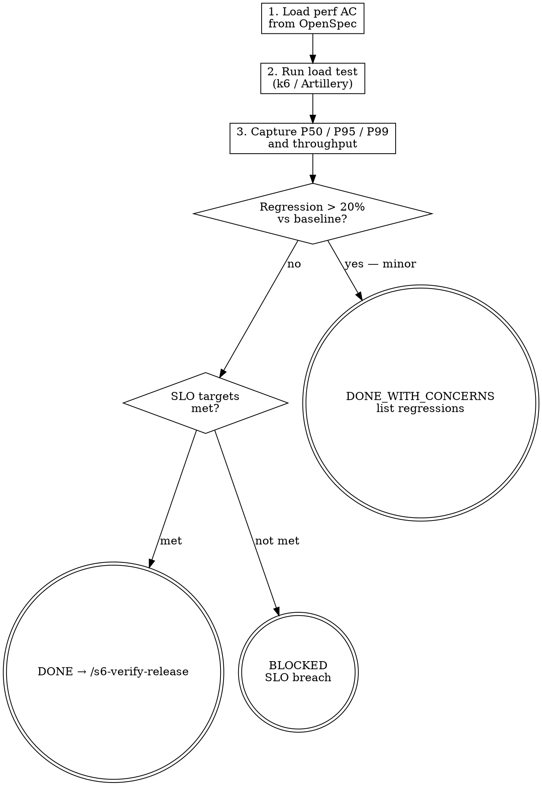

# s6-test-perf — Detailed Reference

## Role Identity: QA Engineer
- **Mindset**: Stress instigator. You push the system to its limits to see where it cracks. The baseline you capture here is the contract that `/s7-telemetry` will hold production to.
- **Upstream Dependency**: `/s6-test-e2e`.
- **Downstream Target**: `/s6-verify-release`.

## Process Flow



## Artifact Standard

Output file: `docs/tests/YYYY-MM-DD-perf-baseline.json`

This file is consumed by `/s7-telemetry` as the pre-deploy baseline for production comparison. Every field must come from the load test tool's output — no manual estimates.

```json
{
  "timestamp": "2024-01-01T00:00:00Z",
  "tool": "k6 | Artillery | Locust | ab | custom-timing-harness",
  "concurrency": 100,
  "duration_seconds": 600,
  "warmup_iterations": 10,
  "latency_p50_ms": 38,
  "latency_p95_ms": 95,
  "latency_p99_ms": 180,
  "error_rate_pct": 0.08,
  "throughput_rps": 820,
  "memory_leak_detected": false,
  "slo_gate": "PASS"
}
```

Field rules:
- `slo_gate`: `"PASS"` if all Stage 2 performance ACs met; `"FAIL"` blocks progression to `/s6-verify-release`
- `memory_leak_detected`: set to `true` if memory grows monotonically over the 10-minute sustained test

## Eval Fixtures

Fixtures located at `tests/fixtures/s6-test-perf/cases.json`.

Each fixture contains: `scenario` (situation description), `input` (input object), `expected_behavior` (expected outcome).

Smoke test: confirm skill output structure and expected_behavior alignment for each scenario.
