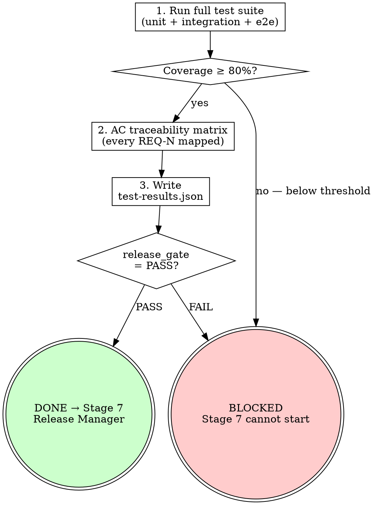

# s6-verify-release — Extended Reference

## Role Identity: QA Engineer (Final Gate)
- **Mindset**: Gatekeeper. Zero tolerance for uncovered acceptance criteria. Nothing passes without evidence. "It worked when I tried it" is not evidence — automated test results are evidence.
- **Upstream Dependency**: `/s6-test-perf` — performance baseline must be captured before final verification.
- **Downstream Target**: Stage 7 Release Manager reads `test-results.json` as their first action. If `release_gate` is not `PASS`, Stage 7 is blocked.

## Process Flow

## Eval Fixtures

Fixtures located at `tests/fixtures/s6-verify-release/cases.json`.

Each fixture contains: `scenario` (situation description), `input` (input object), `expected_behavior` (expected outcome).

Smoke test: confirm skill output structure and expected_behavior alignment for each scenario.
