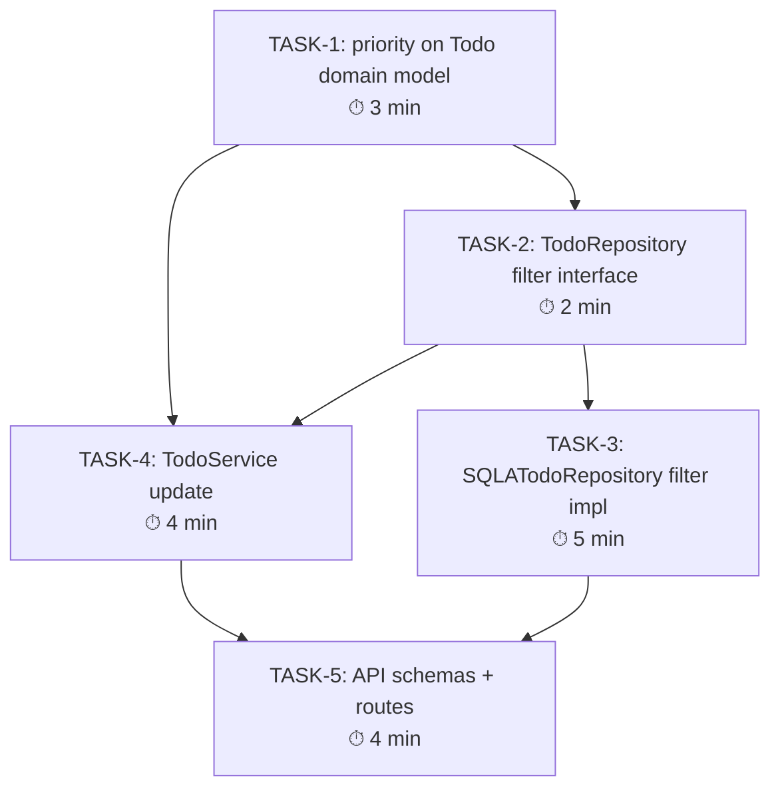

# Task DAG — Priority Filtering Iteration — 2026-05-15

> This iteration adds `priority` field and filter to the existing Todo API.
> Previous iteration (CRUD) was completed. All prior tasks are DONE.
> Do NOT start a task until all its dependencies are marked [DONE].

---

## Dependency Graph

---

## Critical Path

**T1 → T2 → T3 → T5** (total: 14 min)

---

## Task Execution Checklist

- [ ] TASK-1: Add `priority` field to `Todo` domain model (3 min) — deps: none
- [ ] TASK-2: Add `get_by_owner_filtered` to `TodoRepository` interface (2 min) — deps: TASK-1
- [ ] TASK-3: Implement filter in `SQLATodoRepository` + add `priority` to `TodoORM` (5 min) — deps: TASK-2
- [ ] TASK-4: Update `TodoService` (create/list/update accept priority) (4 min) — deps: TASK-1, TASK-2
- [ ] TASK-5: Update API schemas + routes (4 min) — deps: TASK-4, TASK-3
