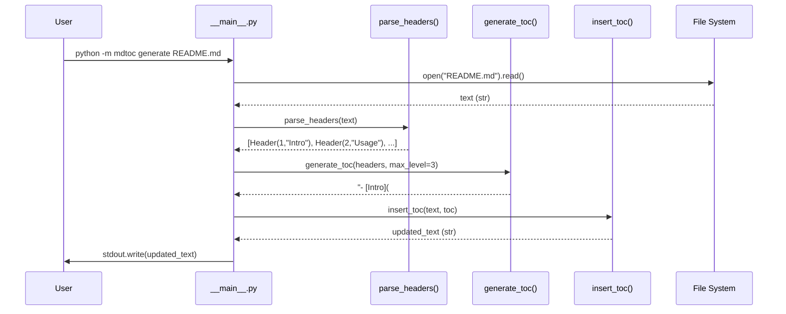
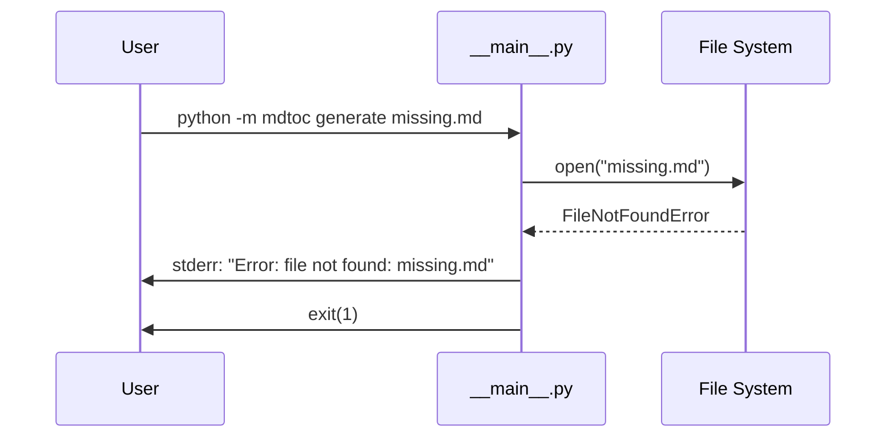

# OpenSpec Design: mdtoc CLI

**Date**: 2026-05-16
**Author**: System Architect (s3-design-arch)
**Source**: `docs/specs/2026-05-16-mdtoc-requirements.md`

---

## Context

**Problem**: No zero-dependency Python CLI tool generates/refreshes a Markdown TOC idempotently using `<!-- TOC -->` markers.

**Constraints**:
- Pure Python 3.9+; zero external runtime dependencies
- CLI: `python -m mdtoc generate <file> [--max-level N] [--in-place]`
- Functions pure where possible; side effects only in CLI layer

**Assumptions**:
- Input files are UTF-8 encoded
- ATX headings only (# syntax); setext-style out of scope
- Anchor slugs follow GitHub-flavored Markdown convention
- Files fit in memory (no streaming required for the performance target)

---

## Decision

**Chosen Approach**: Three-layer pure function design with isolated CLI layer

```
parse_headers(text) → list[Header]
generate_toc(headers, max_level) → str
insert_toc(text, toc) → str
─────────────────────────────────────
CLI (__main__.py): read file → call functions → write output
```

**Rationale**: Each function is pure and independently testable. Side effects (file I/O) are confined to `__main__.py`. This matches the CONTEXT.md AI Boundaries constraint ("functions are pure where possible").

**Rejected Alternatives**:
- **Class-based processor** (`TocProcessor.process(file)`) — unnecessary OOP for 3 pure functions; adds indirection without benefit
- **Streaming line-by-line parse** — not needed for the performance target; whole-file `str.splitlines()` is simpler and faster at this scale

---

## Data Structures

```python
from dataclasses import dataclass

@dataclass
class Header:
    level: int    # 1–6 (number of # characters)
    text: str     # heading text, stripped of leading # and whitespace
```

No other persistent data structures. All intermediate state is local to function scope.

---

## API Contracts

### `parse_headers(text: str) -> list[Header]`

- **Input**: full Markdown file content as a single string
- **Output**: ordered list of `Header` objects, one per ATX heading, in document order
- **Rules**:
  - Line matches ATX heading iff: `re.match(r'^(#{1,6}) (.+)', line)` (exactly one space required after `#`)
  - `level` = number of `#` characters
  - `text` = everything after the space, `.strip()`'d
  - Lines inside fenced code blocks (``` ` ``` ``` or `~~~`) are skipped

### `generate_toc(headers: list[Header], max_level: int = 3) -> str`

- **Input**: list of `Header`; `max_level` int 1–6
- **Output**: Markdown TOC as a string (no trailing newline)
- **Rules**:
  - Headers with `level > max_level` are excluded
  - Each line: `"  " * (level - 1) + f"- [{text}](#{slug})"`
  - Slug: `text.lower()`, replace spaces with `-`, remove chars not in `[a-z0-9-]`
  - Empty input → returns `""`

### `insert_toc(text: str, toc: str) -> str`

- **Input**: full document text; generated TOC string
- **Output**: document text with TOC inserted/replaced
- **Rules**:
  - If `<!-- TOC -->` and `<!-- /TOC -->` exist (outside code blocks): replace content between markers with `\n{toc}\n`
  - If markers absent: prepend `<!-- TOC -->\n{toc}\n<!-- /TOC -->\n\n` to document
  - Idempotent: calling twice produces same result as calling once
  - Markers inside fenced code blocks are ignored

### CLI: `python -m mdtoc generate <file> [--max-level N] [--in-place]`

| Flag | Default | Behavior |
|---|---|---|
| `<file>` | required | Path to Markdown file |
| `--max-level N` | 3 | Maximum heading level in TOC |
| `--in-place` | false | Overwrite file; otherwise write to stdout |

- Exit 0: success
- Exit 1: file not found, permission error, or invalid `--max-level` value

---

## Sequence Diagrams

### Happy Path: stdout output



### Error Path: file not found



---

## Consequences

**Positive**:
- Pure functions make unit tests trivial — no mocking required
- Zero dependencies = `pip install mdtoc` works in any Python 3.9+ environment
- Idempotent design supports safe CI re-runs

**Negative / Trade-offs**:
- Whole-file load: files > 10MB would be slow (accepted — out of realistic use)
- No streaming: won't scale to 100MB files (not a requirement)

**Risks**:
- Code block detection uses simple fence tracking (`in_code_block` flag). Nested fences (rare in practice) may confuse the parser. Mitigation: document limitation.

---

## Delta Spec

**Change ID**: `mdtoc-v1`

### Added
- `src/mdtoc/__init__.py` — exports `parse_headers`, `generate_toc`, `insert_toc`, `Header`
- `src/mdtoc/core.py` — pure function implementations
- `src/mdtoc/__main__.py` — CLI entry point (argparse)
- `tests/test_core.py` — unit tests for all three functions
- `tests/test_cli.py` — integration tests for CLI

### Modified
- (none — new project)

### Removed
- (none)

### Unchanged (explicitly verified)
- (none — new project)
